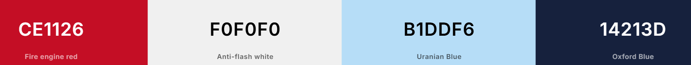

    
  
  # **ClassMatch**

  #### ClassMatch helps students easily connect, create study profiles, and find perfect study partners on campus.

  

  COLOR PALETTE            |  DEMO
:-------------------------:|:-------------------------:
   |  <video width=80% controls><source src="preview.mp4" type="video/mp4">DEMO Video</video>

## **KEY FEATURES:**
ClassMatch helps students connect with others on campus. Users can create and update detailed profiles, send and manage friend requests, and engage in private one-on-one messaging. The platform includes group posts for Super Admins and Group Admins to share content. Users can view and add events to a calendar, and a contact form allows communication with admins. Role-based access ensures only authorized users can manage posts and profiles. Dynamic updates and AJAX integration enhance the user experience.
## **HOW TO USE (Visual Studio Code)**

1. Sign up for an account to create your profile.

2. After logging in, fill out your profile with details like your name, age, major, and hobbies.

3. You can send friend requests to other users and manage incoming requests from your profile page.

4. Once you're friends, you can start messaging your friends in private chats.

5. Use the calendar to view and add events on campus.

6. Admins can create, manage, and delete group posts, while Super Admins have full control over all posts.

7. If needed, you can update or delete your profile, including all associated data like friends and chats.
